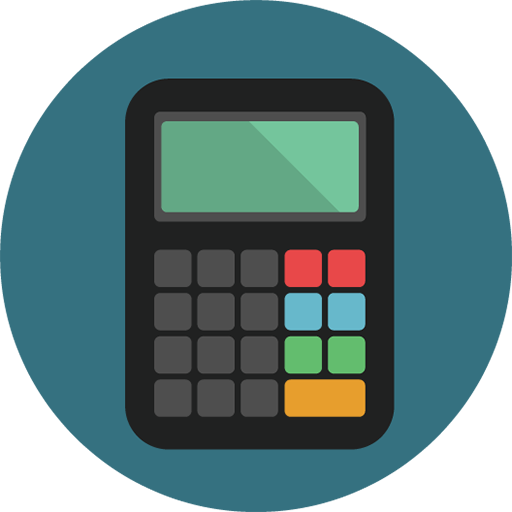

## Programa para calcular o valor de uma viagem! 🚘

> Aqui você ira poder planejar o **valor que gastará** para fazer uma **viagem**. 

1. Preço do combustível;
2. Gasto médio de combustível de carro por KM;
3. Distância em Km da viagem;
4. Valor que gastará.

<h1 aling = "center">
 
</h1>
